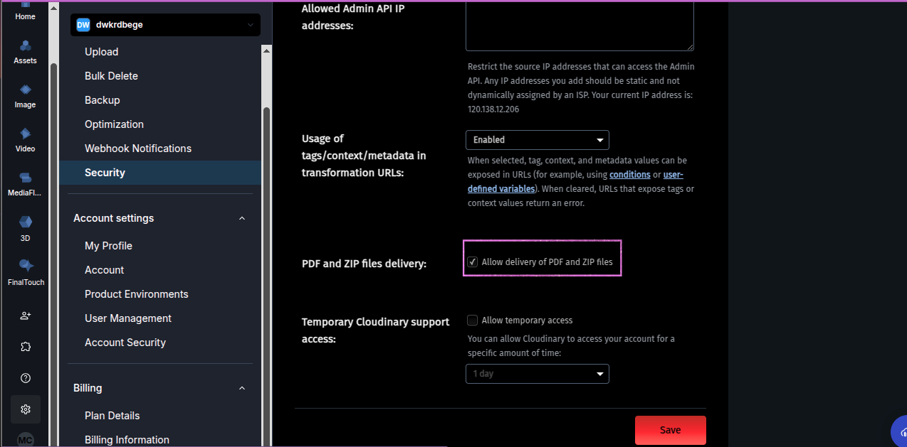
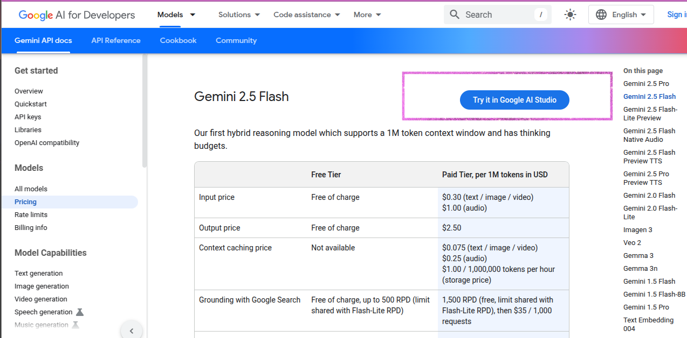
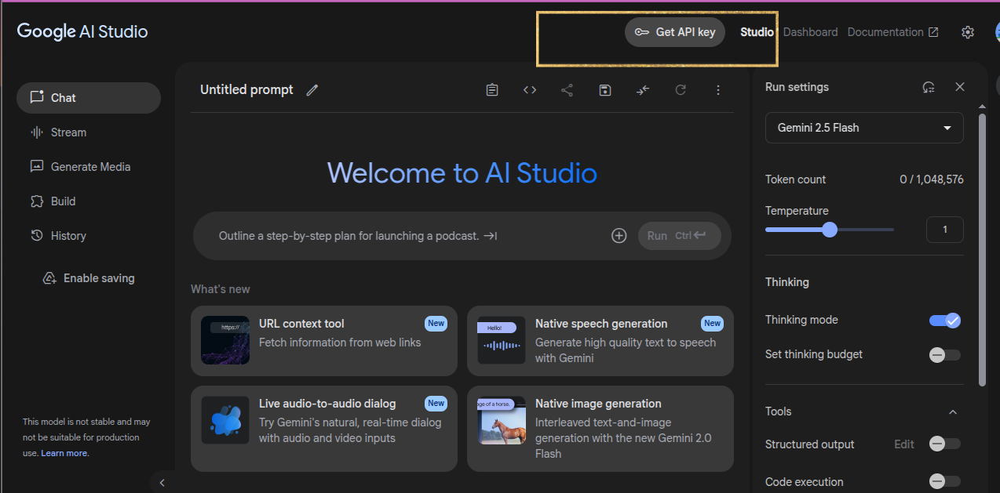
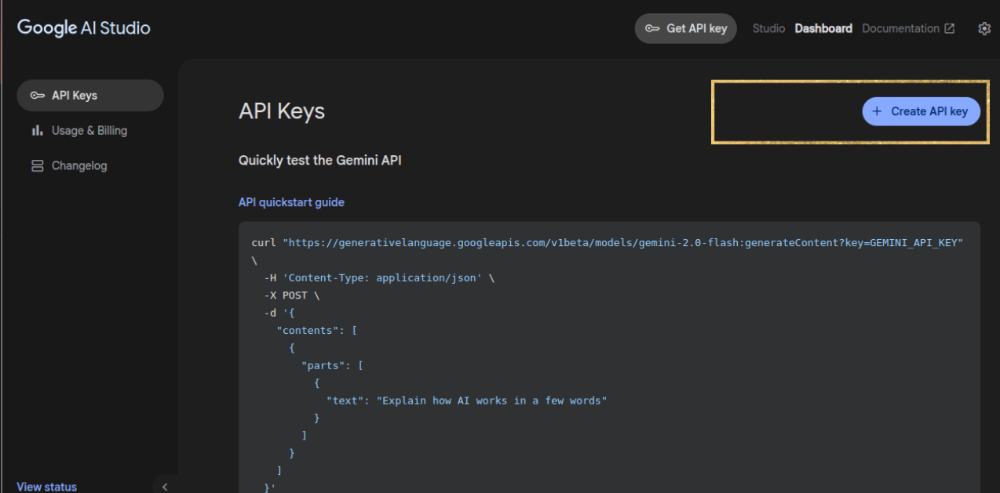
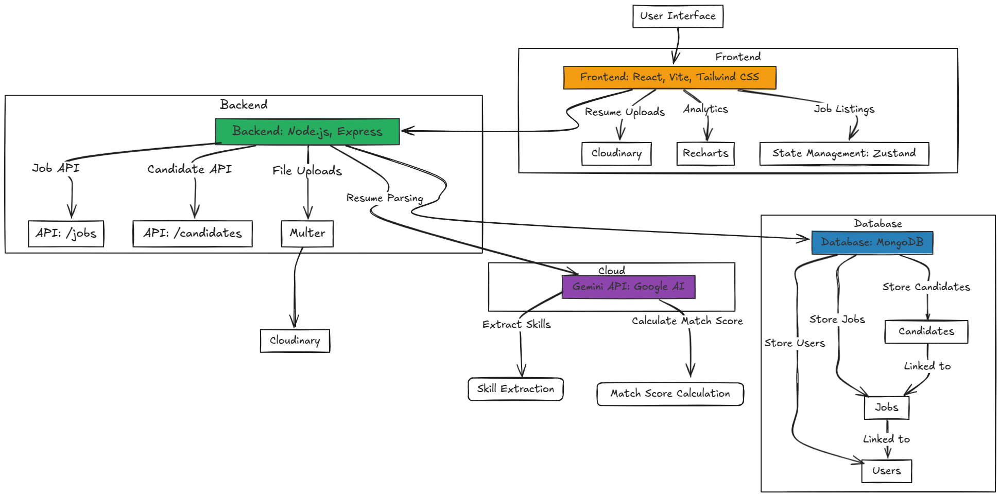

# 🧠 AI-Powered Recruitment Platform

A full-stack recruitment web application that enables recruiters to post jobs and match candidate resumes using AI-based skill extraction and scoring.

---

## 🔥 Features

### 👨‍💼 Recruiter
- Create, edit, and manage job postings
- View applied candidates with **match percentage**
- Analyze **skill distribution** and candidate **analytics**
- Resume previews hosted via **Cloudinary**

### 👨‍💻 Employee
- Browse available jobs
- Apply by uploading resume (PDF/DOCX)
- Match scored using AI (transformers)
- Already-applied job view protection

---

## 🧠 AI/ML Integrations

- **@xenova/transformers**: Extracts skills using transformer models locally (browser/Node)
- **Gemini API (Google)**: Generates a summarized view of the resume
- Matching Score is calculated by comparing extracted skills with job-required skills

---

## ⚙️ Tech Stack

### 🖥️ Frontend
- React (Vite)
- Zustand (state management)
- Axios
- Tailwind CSS
- React Hot Toast
- Recharts (charts)
- React Router DOM

### 🌐 Backend
- Node.js + Express
- MongoDB + Mongoose
- Multer (file handling)
- Cloudinary (resume storage)
- Gemini API (LLM summarization)
- @xenova/transformers (local inference)

---

## 🚀 Running the App

### 1. Clone the repository

```bash
git clone https://github.com/nithishkannan30/Ai-Recruiter-App.git
cd Ai-Recruiter-App
```

---

### 2. Setup Environment

#### 📁 `.env` (Backend)

```env
PORT=5000
MONGO_URI=your_mongodb_connection_string
CLOUDINARY_CLOUD_NAME=your_cloud_name
CLOUDINARY_API_KEY=your_api_key
CLOUDINARY_API_SECRET=your_api_secret
GEMINI_API_KEY=your_gemini_api_key
```
## ☁️ Cloudinary Setup for Resume Uploads

To enable PDF resume uploads and previews via Cloudinary:

1. **Log in** to your [Cloudinary Dashboard](https://cloudinary.com/).
2. Navigate to **Settings** → **Upload** tab.
3. Scroll to the **"Resource Type"** section.
4. **Enable PDF support** by toggling the option that allows PDF uploads and transformations.

This is required to allow users to upload and preview resumes (PDF format) directly in the browser.

### 📸 Example Screenshot

> _Make sure the “PDF” option is enabled under the “Upload” tab:_



## 🤖 Gemini API Setup (Google AI Studio)

To enable **AI-powered resume summarization** using Gemini:

### 🛠️ Steps to Get Your Gemini API Key

1. Visit [Google AI Studio](https://ai.google.dev/gemini-api/docs/pricing).
2. Sign in with your Google account.
3. Click on **API Keys** from the left menu.
4. Click **"Create API key"** and copy the generated key.

> 🔽 _Follow the image below for step-by-step help:_





---

### 3. Install dependencies

#### Backend

```bash
cd backend
npm install
```

#### Frontend

```bash
cd frontend
npm install
```

---

### 4. Run both servers

#### Backend

```bash
cd backend
npm run dev
```

#### Frontend

```bash
cd frontend
npm run dev
```

---

## 📁 Folder Structure Overview

```
frontend/
  └── src/
      ├── pages/
      ├── components/
      └── store/
backend/
  ├── routes/
  ├── models/
  ├── utils/
  └── app.js
```

---
Architecture Diagram:




## 🛡️ Roles

- **Recruiter**: Can manage jobs and see dashboard analytics
- **Employee**: Can apply for jobs using resumes

---

## 📈 Dashboard Analytics

- Number of candidates per job
- Average match score
- Top candidate details
- Skill distribution chart (Bar chart)

---

## 🎯 Future Enhancements

- JWT Authentication
- ChatGPT-powered feedback on resumes
- Email notifications
- Admin moderation

---

## 🙌 Author

Made with ❤️ by Nithish Kannan N
